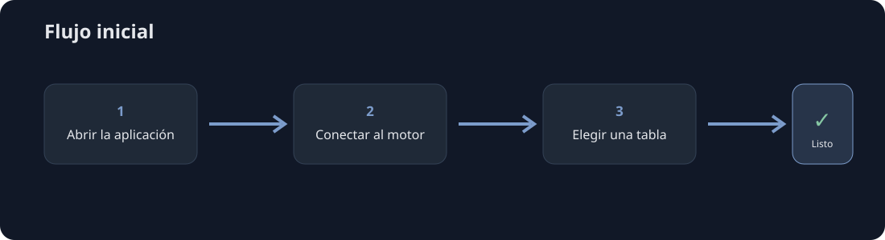
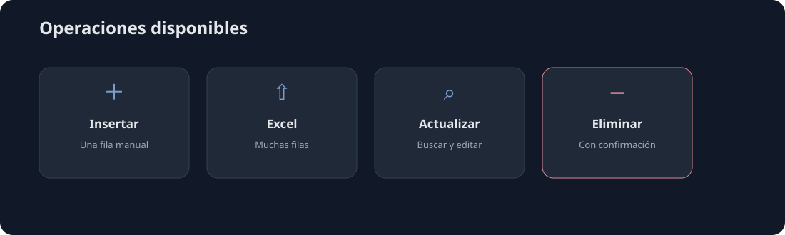
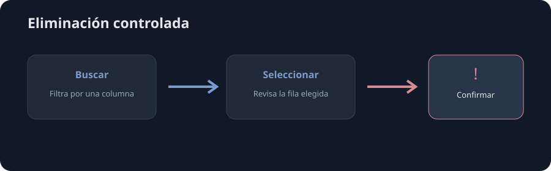

# SQL Record Manager

Aplicación de escritorio para administrar registros de SQL Server y PostgreSQL
sin necesidad de escribir consultas SQL manualmente.



## ¿Qué permite hacer?

- Conectarse a SQL Server o PostgreSQL.
- Detectar tablas, columnas y claves disponibles.
- Insertar registros manualmente.
- Insertar múltiples filas desde Excel.
- Buscar y actualizar registros.
- Buscar y eliminar registros con confirmación.
- Consultar el historial de operaciones.



## Instalación para usuarios finales

La distribución recomendada es entregar un instalador de Windows. El usuario
deberá ejecutar el instalador y no necesitará instalar Python ni las librerías
del proyecto.

El instalador incluirá:

- La aplicación compilada.
- Python y sus dependencias internas.
- Tkinter, `openpyxl`, `Pillow`, `keyring`, `pyodbc` y `psycopg`.
- Los iconos y recursos visuales.
- Accesos directos en el menú Inicio y, opcionalmente, en el escritorio.

## Requisitos externos

El instalador no incluye los servidores de base de datos ni todos los drivers
del sistema.

### SQL Server

El equipo debe tener un driver ODBC compatible con SQL Server. La aplicación
detecta automáticamente los drivers instalados, incluyendo las familias 11,
13, 17, 18 y posteriores.

Descarga oficial:

[Microsoft ODBC Driver for SQL Server](https://learn.microsoft.com/en-us/sql/connect/odbc/download-odbc-driver-for-sql-server)

### PostgreSQL

La aplicación incluye el conector Python para PostgreSQL, pero necesita acceso
a un servidor PostgreSQL existente, ya sea en el mismo equipo o en la red.

Descargas oficiales:

[PostgreSQL para Windows](https://www.postgresql.org/download/windows/)

## Configuración de conexión

Al abrir la aplicación:

1. Selecciona **SQL Server** o **PostgreSQL**.
2. Escribe el servidor y la base de datos.
3. Completa el usuario y la contraseña cuando corresponda.
4. Para SQL Server, selecciona el driver ODBC.
5. Para PostgreSQL, utiliza normalmente el puerto `5432`.
6. Presiona **Conectar y cargar tablas**.
7. Selecciona una tabla y presiona **Usar tabla seleccionada**.

Las credenciales se guardan mediante el almacén seguro del sistema. No deben
escribirse en el código ni compartirse por correo o chat.

## Operaciones principales

### Insertar

Completa los campos obligatorios y presiona **Insertar registro**. Los campos
autogenerados, como `IDENTITY` o `serial`, no se solicitan manualmente.

### Importar Excel

Utiliza archivos `.xlsx` o `.xlsm` con cabeceras compatibles con las columnas de
la tabla. La aplicación muestra una vista previa y ejecuta la carga por lotes.

### Actualizar

Busca una fila, selecciónala, modifica sus valores y confirma la actualización.
Cuando existe una clave primaria o única, se exige que solo se modifique una
fila.

### Eliminar

Busca y selecciona la fila en **Buscar / eliminar**. Revisa el resultado y
confirma la advertencia. Delete es una operación permanente.



### SQL / Logs

Permite revisar las operaciones realizadas, las filas afectadas, el estado de
la transacción y el SQL parametrizado. Los valores reales de las filas no se
guardan en el log.

## Para desarrolladores

Si deseas ejecutar el proyecto desde el código fuente:

```powershell
cd RP-DB
python -m venv .venv
.venv\Scripts\activate
python -m pip install -r requirements.txt
python app.py
```

Las pruebas se ejecutan con:

```powershell
python -m unittest discover -s tests -v
```

La arquitectura se explica en [ARCHITECTURE.md](RP-DB/docs/ARCHITECTURE.md) y
la guía completa de uso está en [GUIA_USUARIO.md](RP-DB/docs/GUIA_USUARIO.md).

## Crear la aplicación distribuible

El proyecto puede empaquetarse con PyInstaller para que el usuario no necesite
Python instalado. PyInstaller debe ejecutarse en Windows para generar la
versión Windows.

Primero instala PyInstaller en el entorno de desarrollo:

```powershell
python -m pip install pyinstaller
```

Después genera una carpeta distribuible:

```powershell
pyinstaller --noconfirm --clean --windowed --onedir `
  --name SQLRecordManager `
  --icon RP-DB/assets/app_window_icon.ico `
  --add-data "RP-DB/assets;assets" `
  RP-DB/app.py
```

El resultado estará en:

```text
dist/SQLRecordManager/
```

La opción `--onedir` crea una carpeta completa y suele ser más sencilla de
probar y mantener. Cuando la aplicación esté validada, puede prepararse un
instalador con esa carpeta para que el usuario tenga una instalación normal de
Windows.

No se recomienda comenzar con `--onefile` porque el ejecutable tarda más en
iniciar y puede complicar la inclusión de recursos visuales o dependencias.

PyInstaller incluye Python y las librerías del proyecto, pero no incluye:

- El driver ODBC de SQL Server.
- El servidor SQL Server o PostgreSQL.
- La conectividad de red y los permisos de la base de datos.

## Licencia

Este proyecto se distribuye bajo la licencia [MIT](LICENSE).
